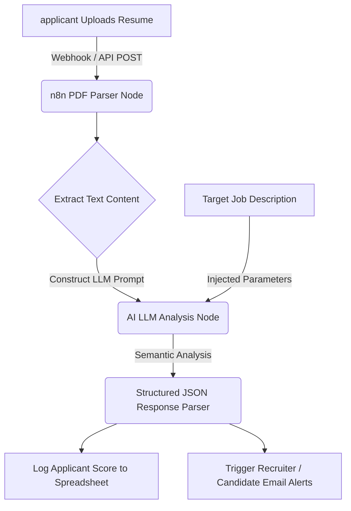

# Automated Resume Relevance Scoring & ATS Parser (n8n + AI)

An advanced, end-to-end workflow built with **n8n** and **AI Large Language Models** to automatically parse, analyze, and score candidate resumes against target Job Descriptions (JD). 

Designed to combat automated ATS rejections and provide deep semantic fit analysis (moving beyond simple keyword matching to examine real capability alignment).

---

## 🚀 Key Features

* **Auto PDF Parsing**: Automatically reads and parses incoming resume PDF documents on upload or webhook trigger.
* **Semantic JD Benchmarking**: Compares the parsed resume text against target job descriptions using advanced LLM reasoning.
* **Multi-Dimensional Scoring**: Outputs scoring categories for:
  * **Overall Fit Score**: 0 to 100% alignment rating.
  * **Core Skills Match**: Identified matching key technical and soft skills.
  * **Skills Gap Analysis**: Specific missing tools, competencies, or experience elements.
  * **Detailed Feedback**: Actionable recommendations summarizing strengths and weaknesses.
* **Webhook & API Ready**: Trigger the workflow via simple POST requests containing the resume file.
* **Notification Layer**: Integrates with notification systems (Google Sheets, Slack, Email) to log applicant scores and alerts immediately.

---

## 🛠️ System Workflow Architecture

1. **Intake**: A webhook receives a POST request containing the resume file (PDF/Docx).
2. **Parsing**: The n8n binary reader extracts raw text from the document payload.
3. **Benchmarking**: The parser combines the resume content with the target Job Description parameters.
4. **AI Evaluation**: The LLM analyzes the capability fit, mapping semantic matches (e.g., recognizing that "fleet routing algorithms" maps to "geospatial logistics experience") rather than scanning simple keywords.
5. **Output**: n8n parses the structured response and fires alerts, database inserts, or sheets updates.

---

## 📦 Getting Started & Installation

To run this automation in your own n8n instance:

### Prerequisites
* A running **n8n** instance (n8n Cloud, Docker, or local installation).
* A **GitHub** account or personal server setup.
* Credentials for an AI Provider (e.g., **OpenAI API Key** or **Anthropic API Key**).

### Setup Instructions
1. Download the **[`workflow.json`](workflow.json)** file from this repository.
2. Open your n8n workspace dashboard.
3. Click on the menu top right $\rightarrow$ Select **Import from File**.
4. Upload the `workflow.json` file.
5. Set up your credentials:
   * Connect your AI model Node (e.g., input your OpenAI API Key).
   * Update the Webhook trigger endpoints.
6. Click **Save** and toggle the workflow state to **Active**!

---

## 📈 Benefits for Recruiting Teams
* **No Keyword Stuffing Exploits**: Since the AI evaluates semantic experience and logical capability, candidates cannot "game" the system simply by copy-pasting the job description in white fonts.
* **Instant Triage**: Automatically shortlists candidate scores to a dashboard in real-time, decreasing time-to-hire.
* **Explainable AI Matching**: Provides detailed reasoning summaries for why an applicant matched (or missed) the criteria, ensuring transparency.
